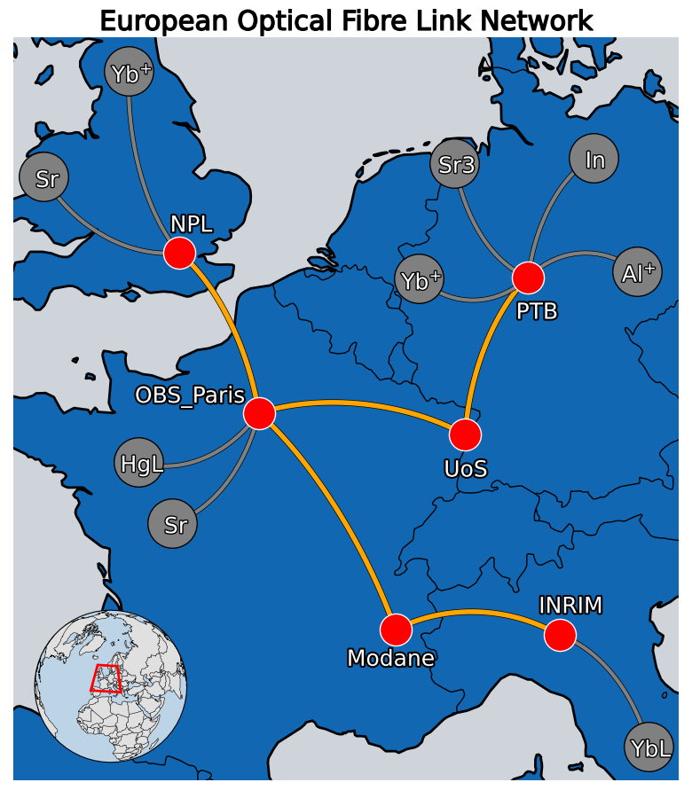

<div align="center" style="background-color:rgb(57, 135, 224); padding: 20px; border-radius: 10px;">

  

  <h1 style="color: #333;">OCC - Optical Clock Comparison</h1>

  <p><em>A toolkit for analyzing and comparing optical clocks.</em></p>

</div>

# Overview of OCC

The following repository is a set of libraries developed to perform an analysis of the clock comparisons campaign.

## Introduction to Comparators

<p align="center">
  
</p>

Comparators are essential in optical frequency metrology, allowing the precise comparison of optical clocks across large distances. Each comparator effectively acts as a bridge between two local oscillators (OSCs), measuring frequency ratios with extremely high precision and enabling long-term stability assessments.

The network of comparators forms a graph, where nodes represent institutes (or clocks), and edges represent the available links. Our framework processes this structure, extracts the shortest comparison paths, and propagates uncertainty accordingly.

### Definition of the Exchange Format

The data exchange is based on the publication of a comparator output for each pair of adjacent oscillators. The comparator output Δ<sub>A→B</sub> resulting from the comparison of oscillators A and B is defined as a scaled measured transfer beat:
```math
\Delta_{A \rightarrow B} = \frac{\hat{f}^T_{A \rightarrow B}}{s_B} = \frac{\hat{\nu}_B - \rho^{0}_{B,A} \hat{\nu}_A}{s_B}
```
where the nominal frequency ratio $( \rho^{0}_{B,A} )$ and the scaling factor $( s_{B} )$ are numerical constants, freely and independently chosen by the operator of each comparator. The frequency reference against which the transfer beat is measured is also freely chosen by the operator.

### Computing Remote Frequency Ratios

The frequency ratios between remote oscillators can be calculated from the comparator outputs using the equations:
```math
\rho_{n,0} = \left( \prod_{i=1}^{n} \rho^{0}_{i, i-1} \right) \left( 1 + \sum_{i=1}^{n} R_{i-1 \rightarrow i} \right)
```
with

```math
R_{i-1 \rightarrow i} \simeq \Delta_{i-1 \rightarrow i} \cdot \frac{s_i / \hat{\nu}_0^0}{\prod_{k=1}^{i} \rho^{0}_{k, k-1}} 
= -\Delta_{i \rightarrow i-1} \cdot \frac{s_{i-1} / \hat{\nu}_0^0}{\prod_{k=1}^{i-1} \rho^{0}_{k, k-1}}
```

In the special case where NFRs are consistently defined from a set of agreed-upon nominal frequencies (i.e., $ \rho^{0}_{B,A} = \hat{\nu}_B^0 / \hat{\nu}_A^0 $ and $s_B = \hat{\nu}_B^0$), remote reduced frequency ratios can be computed with a simple sum of comparator outputs. The example implementation of a clock network proposed in Appendix F of [1] is written using this convention.

## Features 
The libraries created for the data analysis are the following:

* TiMet -> library with functions to deal about timing issues like: time conversion, time matching, time stamp, etc
* datamet -> library with functions to load Campaign data and to develop the network oscillators and the corresponding graph.
* opt_met -> Functions for data processing ratios between optical clocks
* Metronauta -> library with functions to deal with the statistical analysis of optical clock comparisons.
* VisMet: Visualization Metrology -> library with tools for visualization of the Campaign Network.

## Installation and Dependencies
This project and the libraries inside require Python ≥ 3.8. It is recommended to create a virtual environment with the file "requirements.txt". Here there is a guide to clone the repository locally and create the virtual environment.

### Clone the repository

```bash
git clone https://gitlab.com/your-username/your-repo.git
cd your-repo
```

### Create and activate environment
** On Windows (CMD) **

```bash
python -m venv venv
venv\Scripts\activate.bat
```

** On Linux/macOS **

``` bash
python3 -m venv venv
source venv/bin/activate
```

### Install dependencies
```bash
pip install -r requirements.txt
```
## Usage

Once the repo has been cloned the environment was created, running the code to obtain the ratios between optical clocks should be straight-forward. 

The file to run in an Ipython/Python console is "main.py". The script is essentially divided in two parts. The first deals with loading the campaign data and performs the calculation of the Ratios between oscillators. The second part it's focus con the uncertainty calculation for each pair of comparison and plotting the Ratio data. In the next paragraphs I will make a deeper description of both parts.

### Part I: Loading data and ratio calculation.

The first section of the main.py script is the following>

```python
data_folder =  "data_2025_03_TOCK/"
data_dict = dm.load_all_data(data_folder)

G, folders, paths = dm.build_clock_network(
    data_folder=data_folder,
    yaml_path="oscillators.yml",
    pair_file="oscillator_pairs.txt"
)

t0 = time.time()
ratio_campaign = {}

for i,key in enumerate(list(paths.keys())):
    print(f'Computing ratio for {key[0]} - {key[1]}')
    print(f'Comparator {i} of {len(paths.keys())}')
    try:
        ratio_data = ratio_dat(data_dict, paths, key)
        ratio_campaign[key] = ratio_data
    except Exception as e:
        print(f"Failed for {key[0]} - {key[1]}: {e}")

t1 = time.time()
print(f"Done computing all ratios in {t1 - t0:.2f} seconds.")
```

**data_folder** is the path inside the repository folder where you have the campaign data. It should be excluded any folder with a name that does not match the parttern "INSm_OSCa-INSn_OSC_b". That folder has the beatnote between Oscillator "a" (located at Institute "m") and Oscillator "b" (located at Institute "n").

**oscillators.yml** is a config file with the information of the optical clocks of the campaign and their nominal absolute frequencies in Hz. It also has the grs correction in relative terms. This file is included in the repo and should not be removed.

**oscillator_pairs.txt** is the list of oscillators comparisons defined by the user. In each line should be put the names of the oscillators to compare separated by "-". For e.g.

```
PTB_Al_CombAl - PTB_In_CombKnoten
NPL_YbE3 - PTB_In_CombKnoten
INRIM_ITYb1 - OBSPARIS_SrB
```
It is possible to put **None** in the variable *pair_file*. In this case the script will find all the possible combinations of two oscillators of the Network and calculate all the ratios of that list.

The next lines of this section performs the proper calculations of all the possible ratios. The output is the ratio_campaign dictionary where the keys are the pair of oscillators. All the ratio data is saved by default in the folder called `ratio_data/' where folders with the pattern of the previous list mentioned will be created. Inside each folder there will be the daily ratio of that pair of oscillators.

#### Folder structure
```text
your-repo/
├── README.md
├── main.py
├── ratio_data/
│   ├── INRIM_ITYb1-INRIM_PTBSr4/
|   |    ├──2025-03-14_INRIM_ITYb1-INRIM_PTBSr4.dat
|   |    ├──2025-03-17_INRIM_ITYb1-INRIM_PTBSr4.dat
|   |    └── ...
│   └── NPL_YbE3-PTB_Al_CombAl/
└── ...
```
### Part II: Uncertainty computation and plotting.